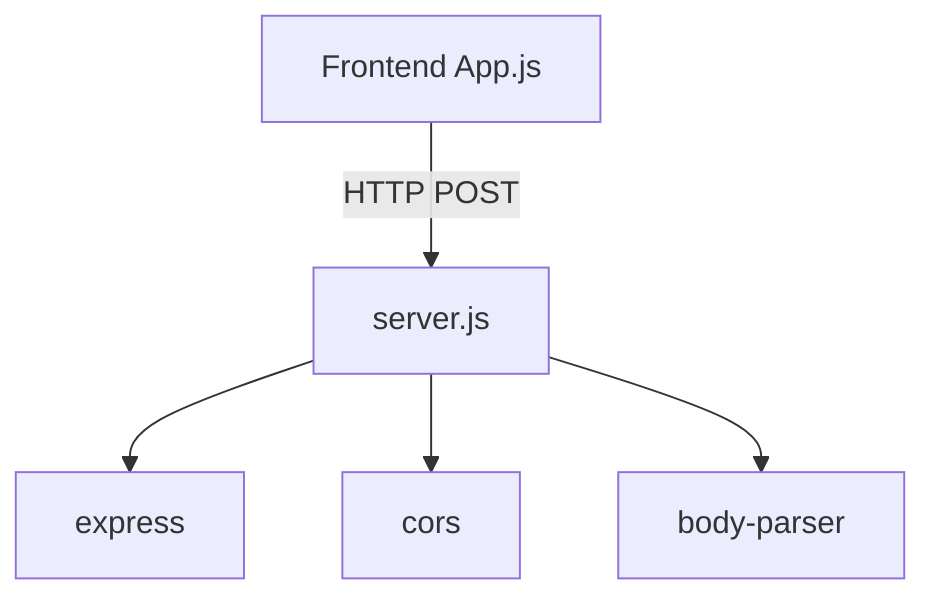
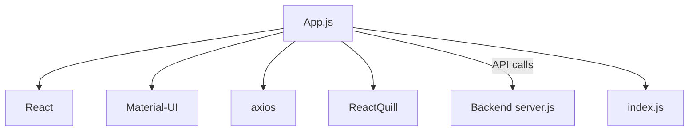
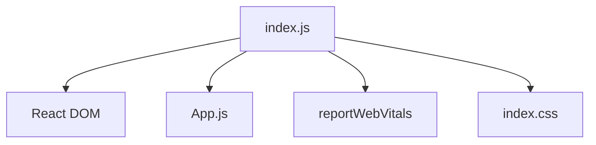
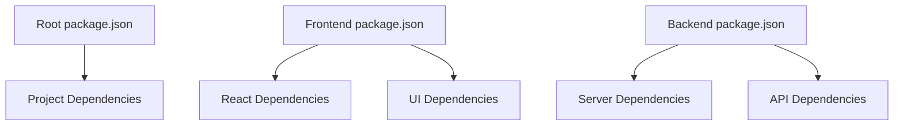

# Table of Contents

- [Directory](#directory)
- [Analysis](#analysis)
- [Code Files](#code-files)
- [Report Generated On](#report-generated-on)

# Report Generated On

*Generated on 12/13/2024, 5:28:07 PM*


# Directory

```
package.json
server.js
package.json
index.html
manifest.json
robots.txt
README.md
App.css
App.js
App.test.js
index.css
index.js
reportWebVitals.js
setupTests.js
package.json

```

# Analysis

I'll analyze the key files and their interactions:

### backend/server.js

**Explanation:**
This is an Express.js server that generates HTML email templates for different release notification types. It provides a single endpoint `/generate-email` that accepts POST requests with email type and data to generate customized HTML email templates for different stages of software deployment.

**Interactions:**
- Imports `express`, `cors`, and `body-parser` from node_modules
- Exposes an API endpoint that the frontend calls using axios



### frontend/src/App.js

**Explanation:**
The main React component that provides a form interface for generating email templates. It includes form fields for different types of release notifications and displays a preview of the generated email.

**Interactions:**
- Imports React components from `react`
- Uses Material-UI components for UI
- Uses axios for API calls to backend
- Uses ReactQuill for rich text editing
- Renders the generated email in an iframe



### frontend/src/index.js

**Explanation:**
The entry point of the React application that renders the main App component and sets up React's strict mode.

**Interactions:**
- Imports the main App component
- Imports React DOM for rendering
- Imports reportWebVitals for performance monitoring



### package.json Files

**Explanation:**
There are three package.json files:
1. Root: Contains basic dependencies for the project
2. Frontend: Contains React and UI-related dependencies
3. Backend: Contains Express and server-related dependencies

**Interactions:**
- Define project dependencies
- Configure scripts for running the application
- Manage separate dependencies for frontend and backend



This is a full-stack application where:
- The backend generates email templates based on user input
- The frontend provides a user interface for inputting data and previewing generated emails
- The application uses modern React features and Material-UI for styling
- The system is split into separate frontend and backend services that communicate via HTTP

The architecture follows a typical client-server model with clear separation of concerns between the UI layer and the template generation logic.

# Code Files

## backend/package.json

```json
{
  "name": "backend",
  "version": "1.0.0",
  "main": "index.js",
  "scripts": {
    "test": "echo \"Error: no test specified\" && exit 1"
  },
  "keywords": [],
  "author": "",
  "license": "ISC",
  "description": "",
  "dependencies": {
    "body-parser": "^1.20.3",
    "cors": "^2.8.5",
    "express": "^4.21.0",
    "nodemailer": "^6.9.15",
    "react-quill": "^2.0.0"
  },
  "devDependencies": {
    "nodemon": "^3.1.7"
  }
}

```

## backend/server.js

```js
const express = require('express');
const cors = require('cors');
const bodyParser = require('body-parser');

const app = express();
const port = 5000;

app.use(cors());
app.use(bodyParser.json());

function generateEmailTemplate(type, data) {
    const logoUrl = 'https://www.parkoursc.com/wp-content/uploads/2022/03/ParkourSC-Logo_Horizontal.png';
    const commonTemplate = `
    <!DOCTYPE html PUBLIC "-//W3C//DTD XHTML 1.0 Transitional//EN" "http://www.w3.org/TR/xhtml1/DTD/xhtml1-transitional.dtd">
    <html xmlns="http://www.w3.org/1999/xhtml">
    <head>
      <meta http-equiv="Content-Type" content="text/html; charset=utf-8" />
      <meta name="viewport" content="width=device-width, initial-scale=1.0" />
      <title>ParkourSC Release Notification</title>
      <style type="text/css">
        body, p { font-family: Arial, sans-serif; line-height: 1.6; color: #333; margin: 0; padding: 0; }
        .content-area { background-color: #f0f0f0; }
        .header { background-color: #012160; color: white; padding: 20px; text-align: center; }
        .logo { max-width: 200px; height: auto; }
        .section { position: relative; padding-left: 60px; margin-bottom: 20px; min-height: 50px; }
        .icon { position: absolute; left: 0; top: 0; width: 50px; height: 50px; text-align: center; line-height: 50px; color: white; font-size: 24px; }
        .check-icon { background-color: #012160; }
        .exclamation-icon { background-color: #3366cc; }
        .question-icon { background-color: #ffa500; }
        h2 { color: #012160; margin-top: 0; }
        ul { padding-left: 20px; }
      </style>
    </head>
    <body style="margin: 0; padding: 0; background-color: #f0f0f0;">
      <table border="0" cellpadding="0" cellspacing="0" width="100%">
        <tr>
          <td>
            <table align="center" border="0" cellpadding="0" cellspacing="0" width="810" style="border-collapse: collapse; background-color: #f0f0f0;">
              <tr>
                <td class="header">
                  <h1 style="margin: 0; color: white;">Release Train ${data.releaseVersion}</h1>
                  <p style="margin: 10px 0 0; color: white;">Now available in your ${type.includes('uat') ? 'Preview' : 'Production'} Environment!</p>
                </td>
              </tr>
              <tr>
                <td align="center" style="padding: 20px;">
                  
                </td>
              </tr>
              <tr>
                <td class="content-area" style="padding: 20px;">
                  ${getContentByType(type, data)}
                </td>
              </tr>
              <tr>
                <td style="padding: 20px; font-size: 12px;">
                  <p>Please feel free to contact the Customer Success(CS) Team with any questions.</p>
                  <p>Thank you for your partnership!</p>
                  <p>The ParkourSC Customer Success Team</p>
                  <p>© 2024 ParkourSC. All Rights Reserved.</p>
                  <p>STRICTLY CONFIDENTIAL. NOT FOR FURTHER DISTRIBUTION.</p>
                  <table border="0" cellpadding="0" cellspacing="0">
                    <tr>
                      <td>
                        <a href="mailto:appsupport@parkoursc.com"></a>
                      </td>
                      <td style="width: 10px;"></td>
                      <td>
                        <a href="https://www.linkedin.com/company/parkoursc"></a>
                      </td>
                    </tr>
                  </table>
                </td>
              </tr>
            </table>
          </td>
        </tr>
      </table>
    </body>
    </html>
  `;

    return commonTemplate;
}

function getContentByType(type, data) {
    const commonSection = (icon, title, content) => `
    <div class="section">
      <div class="icon ${icon}">${icon === 'check-icon' ? '✓' : icon === 'exclamation-icon' ? '!' : '?'}</div>
      <h2>${title}</h2>
      ${content}
    </div>
  `;

    switch (type) {
        case '7_days_before_uat':
            return `
        ${commonSection('check-icon', `We're excited to introduce ${data.releaseVersion}`, `
          <p>The latest release will be deployed to your <strong>Preview</strong> environment!</p>
          <p><strong>Deployment Date:</strong> ${data.deploymentDate}</p>
          <p><strong>Deployment Time:</strong> ${data.deploymentTime}</p>
          <p>Please use this time to prepare for the upcoming release. The Preview environment will be available for you to explore the new features and functionalities after the deployment.</p>
        `)}
        ${commonSection('question-icon', "What's New?", `
          ${data.releaseNotes}
        `)}
        <p style="text-align: center;"><a href="${data.pdfLink}">PDF: The Latest ParkourSC Release Notes</a></p>
      `;
        case 'uat_complete':
            return `
        ${commonSection('check-icon', `We're excited to introduce ${data.releaseVersion}`, `
          <p>The latest release was deployed and available in your <strong>Preview</strong> environment!</p>
          <p>Please use the Preview period to explore the Release in the Preview environment, ask questions, and better understand the changes. As always, your current functionality will remain the same, and you will have time to adapt it to your business process. The new functionality will be there for you to use when you are ready!</p>
        `)}
        ${commonSection('exclamation-icon', 'Upcoming Production Deployment', `
          <p>${data.productionDeploymentDate}</p>
          <p>Change Window: ${data.changeWindowStart} to ${data.changeWindowEnd}</p>
          <p>Please note, during the maintenance window, the <strong>Production</strong> environment will be inaccessible, and all API calls should be paused. All operations can be resumed immediately after the maintenance window.</p>
        `)}
        ${commonSection('question-icon', "What's New?", `
          ${data.releaseNotes}
        `)}
        <p style="text-align: center;"><a href="${data.pdfLink}">PDF: The Latest ParkourSC Release Notes</a></p>
      `;
        case 'prod_begins':
            return `
        ${commonSection('exclamation-icon', 'Production Deployment Begins', `
          <p>We are excited to announce that the deployment of ${data.releaseVersion} to the <strong>Production</strong> environment has begun.</p>
          <p><strong>Deployment Date:</strong> ${data.productionDeploymentDate}</p>
          <p><strong>Change Window:</strong> ${data.changeWindowStart} to ${data.changeWindowEnd}</p>
          <p>Please note that during this maintenance window, the Production environment will be inaccessible, and all API calls should be paused. All operations can be resumed immediately after the maintenance window.</p>
        `)}
        ${commonSection('question-icon', "What's New?", `
          ${data.releaseNotes}
        `)}
        <p style="text-align: center;"><a href="${data.pdfLink}">PDF: The Latest ParkourSC Release Notes</a></p>
      `;
        case 'prod_complete':
            return `
        ${commonSection('check-icon', 'Production Deployment Complete', `
          <p>We are pleased to announce that ${data.releaseVersion} has been successfully deployed to the <strong>Production</strong> environment.</p>
          <p>All systems are operational, and you can now take advantage of the new features and improvements.</p>
        `)}
        ${commonSection('question-icon', "What's New?", `
          ${data.releaseNotes}
        `)}
        <p style="text-align: center;"><a href="${data.pdfLink}">PDF: The Latest ParkourSC Release Notes</a></p>
      `;
        default:
            return '<p>Invalid email type</p>';
    }
}

app.post('/generate-email', (req, res) => {
    const { type, data } = req.body;
    const emailHtml = generateEmailTemplate(type, data);
    res.json({ html: emailHtml });
});

app.listen(port, () => {
    console.log(`Server running on port ${port}`);
});

```

## frontend/package.json

```json
{
  "name": "frontend",
  "version": "0.1.0",
  "private": true,
  "dependencies": {
    "@emotion/react": "^11.13.3",
    "@emotion/styled": "^11.13.0",
    "@mui/icons-material": "^6.1.1",
    "@mui/material": "^6.1.1",
    "@testing-library/jest-dom": "^5.17.0",
    "@testing-library/react": "^13.4.0",
    "@testing-library/user-event": "^13.5.0",
    "axios": "^1.7.7",
    "react": "^18.3.1",
    "react-dom": "^18.3.1",
    "react-quill": "^2.0.0",
    "react-scripts": "^5.0.1",
    "styled-components": "^6.1.13",
    "web-vitals": "^2.1.4"
  },
  "scripts": {
    "start": "react-scripts start",
    "build": "react-scripts build",
    "test": "react-scripts test",
    "eject": "react-scripts eject"
  },
  "eslintConfig": {
    "extends": [
      "react-app",
      "react-app/jest"
    ]
  },
  "browserslist": {
    "production": [
      ">0.2%",
      "not dead",
      "not op_mini all"
    ],
    "development": [
      "last 1 chrome version",
      "last 1 firefox version",
      "last 1 safari version"
    ]
  }
}

```

## frontend/public/index.html

```html
<!DOCTYPE html>
<html lang="en">
  <head>
    <meta charset="utf-8" />
    <link rel="icon" href="%PUBLIC_URL%/favicon.ico" />
    <meta name="viewport" content="width=device-width, initial-scale=1" />
    <meta name="theme-color" content="#000000" />
    <meta
      name="description"
      content="Web site created using create-react-app"
    />
    <link rel="apple-touch-icon" href="%PUBLIC_URL%/logo192.png" />
    <!--
      manifest.json provides metadata used when your web app is installed on a
      user's mobile device or desktop. See https://developers.google.com/web/fundamentals/web-app-manifest/
    -->
    <link rel="manifest" href="%PUBLIC_URL%/manifest.json" />
    <!--
      Notice the use of %PUBLIC_URL% in the tags above.
      It will be replaced with the URL of the `public` folder during the build.
      Only files inside the `public` folder can be referenced from the HTML.

      Unlike "/favicon.ico" or "favicon.ico", "%PUBLIC_URL%/favicon.ico" will
      work correctly both with client-side routing and a non-root public URL.
      Learn how to configure a non-root public URL by running `npm run build`.
    -->
    <title>React App</title>
  </head>
  <body>
    <noscript>You need to enable JavaScript to run this app.</noscript>
    <div id="root"></div>
    <!--
      This HTML file is a template.
      If you open it directly in the browser, you will see an empty page.

      You can add webfonts, meta tags, or analytics to this file.
      The build step will place the bundled scripts into the <body> tag.

      To begin the development, run `npm start` or `yarn start`.
      To create a production bundle, use `npm run build` or `yarn build`.
    -->
  </body>
</html>

```

## frontend/public/manifest.json

```json
{
  "short_name": "React App",
  "name": "Create React App Sample",
  "icons": [
    {
      "src": "favicon.ico",
      "sizes": "64x64 32x32 24x24 16x16",
      "type": "image/x-icon"
    },
    {
      "src": "logo192.png",
      "type": "image/png",
      "sizes": "192x192"
    },
    {
      "src": "logo512.png",
      "type": "image/png",
      "sizes": "512x512"
    }
  ],
  "start_url": ".",
  "display": "standalone",
  "theme_color": "#000000",
  "background_color": "#ffffff"
}

```

## frontend/public/robots.txt

```txt
# https://www.robotstxt.org/robotstxt.html
User-agent: *
Disallow:

```

## frontend/README.md

```md
# Getting Started with Create React App

This project was bootstrapped with [Create React App](https://github.com/facebook/create-react-app).

## Available Scripts

In the project directory, you can run:

### `npm start`

Runs the app in the development mode.\
Open [http://localhost:3000](http://localhost:3000) to view it in your browser.

The page will reload when you make changes.\
You may also see any lint errors in the console.

### `npm test`

Launches the test runner in the interactive watch mode.\
See the section about [running tests](https://facebook.github.io/create-react-app/docs/running-tests) for more information.

### `npm run build`

Builds the app for production to the `build` folder.\
It correctly bundles React in production mode and optimizes the build for the best performance.

The build is minified and the filenames include the hashes.\
Your app is ready to be deployed!

See the section about [deployment](https://facebook.github.io/create-react-app/docs/deployment) for more information.

### `npm run eject`

**Note: this is a one-way operation. Once you `eject`, you can't go back!**

If you aren't satisfied with the build tool and configuration choices, you can `eject` at any time. This command will remove the single build dependency from your project.

Instead, it will copy all the configuration files and the transitive dependencies (webpack, Babel, ESLint, etc) right into your project so you have full control over them. All of the commands except `eject` will still work, but they will point to the copied scripts so you can tweak them. At this point you're on your own.

You don't have to ever use `eject`. The curated feature set is suitable for small and middle deployments, and you shouldn't feel obligated to use this feature. However we understand that this tool wouldn't be useful if you couldn't customize it when you are ready for it.

## Learn More

You can learn more in the [Create React App documentation](https://facebook.github.io/create-react-app/docs/getting-started).

To learn React, check out the [React documentation](https://reactjs.org/).

### Code Splitting

This section has moved here: [https://facebook.github.io/create-react-app/docs/code-splitting](https://facebook.github.io/create-react-app/docs/code-splitting)

### Analyzing the Bundle Size

This section has moved here: [https://facebook.github.io/create-react-app/docs/analyzing-the-bundle-size](https://facebook.github.io/create-react-app/docs/analyzing-the-bundle-size)

### Making a Progressive Web App

This section has moved here: [https://facebook.github.io/create-react-app/docs/making-a-progressive-web-app](https://facebook.github.io/create-react-app/docs/making-a-progressive-web-app)

### Advanced Configuration

This section has moved here: [https://facebook.github.io/create-react-app/docs/advanced-configuration](https://facebook.github.io/create-react-app/docs/advanced-configuration)

### Deployment

This section has moved here: [https://facebook.github.io/create-react-app/docs/deployment](https://facebook.github.io/create-react-app/docs/deployment)

### `npm run build` fails to minify

This section has moved here: [https://facebook.github.io/create-react-app/docs/troubleshooting#npm-run-build-fails-to-minify](https://facebook.github.io/create-react-app/docs/troubleshooting#npm-run-build-fails-to-minify)

```

## frontend/src/App.css

```css
.App {
  text-align: center;
}

.App-logo {
  height: 40vmin;
  pointer-events: none;
}

@media (prefers-reduced-motion: no-preference) {
  .App-logo {
    animation: App-logo-spin infinite 20s linear;
  }
}

.App-header {
  background-color: #282c34;
  min-height: 100vh;
  display: flex;
  flex-direction: column;
  align-items: center;
  justify-content: center;
  font-size: calc(10px + 2vmin);
  color: white;
}

.App-link {
  color: #61dafb;
}

@keyframes App-logo-spin {
  from {
    transform: rotate(0deg);
  }
  to {
    transform: rotate(360deg);
  }
}

```

## frontend/src/App.js

```js
import React, { useState, useRef } from 'react';
import axios from 'axios';
import ReactQuill from 'react-quill';
import 'react-quill/dist/quill.snow.css';
import {
  Container,
  Typography,
  Select,
  MenuItem,
  TextField,
  Button,
  Box,
  Paper,
  FormControl,
  InputLabel,
  Grid,
  Snackbar
} from '@mui/material';
import ContentCopyIcon from '@mui/icons-material/ContentCopy';

function App() {
  const [emailType, setEmailType] = useState('7_days_before_uat');
  const [formData, setFormData] = useState({
    releaseVersion: '',
    deploymentDate: '',
    deploymentTime: '',
    productionDeploymentDate: '',
    changeWindowStart: '',
    changeWindowEnd: '',
    pdfLink: '',
    releaseNotes: ''
  });
  const [generatedHtml, setGeneratedHtml] = useState('');
  const [snackbarOpen, setSnackbarOpen] = useState(false);
  const iframeRef = useRef(null);

  const handleTypeChange = (e) => {
    setEmailType(e.target.value);
    setFormData({
      releaseVersion: '',
      deploymentDate: '',
      deploymentTime: '',
      productionDeploymentDate: '',
      changeWindowStart: '',
      changeWindowEnd: '',
      pdfLink: '',
      releaseNotes: ''
    });
  };

  const handleInputChange = (e) => {
    setFormData({ ...formData, [e.target.name]: e.target.value });
  };

  const handleReleaseNotesChange = (content) => {
    setFormData({ ...formData, releaseNotes: content });
  };

  const handleSubmit = async (e) => {
    e.preventDefault();
    try {
      const response = await axios.post('http://localhost:5000/generate-email', {
        type: emailType,
        data: formData,
      });
      setGeneratedHtml(response.data.html);
    } catch (error) {
      console.error('Error generating email:', error);
    }
  };

  const copyHtmlToClipboard = () => {
    navigator.clipboard.writeText(generatedHtml).then(() => {
      setSnackbarOpen(true);
    });
  };

  const copyEmailContent = () => {
    if (iframeRef.current) {
      const iframeDocument = iframeRef.current.contentDocument;
      if (iframeDocument) {
        const selection = iframeDocument.getSelection();
        const range = iframeDocument.createRange();
        range.selectNodeContents(iframeDocument.body);
        selection.removeAllRanges();
        selection.addRange(range);
        iframeDocument.execCommand('copy');
        selection.removeAllRanges();
        setSnackbarOpen(true);
      }
    }
  };

  const renderFormFields = () => {
    switch (emailType) {
      case '7_days_before_uat':
        return (
          <Grid container spacing={2}>
            <Grid item xs={12}>
              <TextField
                fullWidth
                name="releaseVersion"
                label="Release Version"
                variant="outlined"
                value={formData.releaseVersion}
                onChange={handleInputChange}
                helperText="e.g., RT23.3"
              />
            </Grid>
            <Grid item xs={12} sm={6}>
              <TextField
                fullWidth
                name="deploymentDate"
                label="UAT Deployment Date"
                type="date"
                variant="outlined"
                InputLabelProps={{ shrink: true }}
                value={formData.deploymentDate}
                onChange={handleInputChange}
                helperText="Date of UAT deployment"
              />
            </Grid>
            <Grid item xs={12} sm={6}>
              <TextField
                fullWidth
                name="deploymentTime"
                label="UAT Deployment Time"
                type="time"
                variant="outlined"
                InputLabelProps={{ shrink: true }}
                value={formData.deploymentTime}
                onChange={handleInputChange}
                helperText="Time of UAT deployment"
              />
            </Grid>
          </Grid>
        );
      case 'uat_complete':
        return (
          <Grid container spacing={2}>
            <Grid item xs={12}>
              <TextField
                fullWidth
                name="releaseVersion"
                label="Release Version"
                variant="outlined"
                value={formData.releaseVersion}
                onChange={handleInputChange}
                helperText="e.g., RT23.3"
              />
            </Grid>
            <Grid item xs={12} sm={6}>
              <TextField
                fullWidth
                name="productionDeploymentDate"
                label="Production Deployment Date"
                type="date"
                variant="outlined"
                InputLabelProps={{ shrink: true }}
                value={formData.productionDeploymentDate}
                onChange={handleInputChange}
                helperText="Date of production deployment"
              />
            </Grid>
            <Grid item xs={12} sm={6}>
              <TextField
                fullWidth
                name="changeWindowStart"
                label="Change Window Start"
                type="time"
                variant="outlined"
                InputLabelProps={{ shrink: true }}
                value={formData.changeWindowStart}
                onChange={handleInputChange}
                helperText="Start time of the change window"
              />
            </Grid>
            <Grid item xs={12} sm={6}>
              <TextField
                fullWidth
                name="changeWindowEnd"
                label="Change Window End"
                type="time"
                variant="outlined"
                InputLabelProps={{ shrink: true }}
                value={formData.changeWindowEnd}
                onChange={handleInputChange}
                helperText="End time of the change window"
              />
            </Grid>
            <Grid item xs={12}>
              <Typography variant="subtitle1">Release Notes</Typography>
              <ReactQuill
                value={formData.releaseNotes}
                onChange={handleReleaseNotesChange}
                style={{ height: '200px', marginBottom: '50px' }}
              />
            </Grid>
            <Grid item xs={12}>
              <TextField
                fullWidth
                name="pdfLink"
                label="PDF Link"
                variant="outlined"
                value={formData.pdfLink}
                onChange={handleInputChange}
                helperText="Link to the release notes PDF"
              />
            </Grid>
          </Grid>
        );
      case 'prod_begins':
        return (
          <Grid container spacing={2}>
            <Grid item xs={12}>
              <TextField
                fullWidth
                name="releaseVersion"
                label="Release Version"
                variant="outlined"
                value={formData.releaseVersion}
                onChange={handleInputChange}
                helperText="e.g., RT23.3"
              />
            </Grid>
            <Grid item xs={12} sm={6}>
              <TextField
                fullWidth
                name="productionDeploymentDate"
                label="Production Deployment Date"
                type="date"
                variant="outlined"
                InputLabelProps={{ shrink: true }}
                value={formData.productionDeploymentDate}
                onChange={handleInputChange}
                helperText="Date of production deployment"
              />
            </Grid>
            <Grid item xs={12} sm={6}>
              <TextField
                fullWidth
                name="changeWindowStart"
                label="Change Window Start"
                type="time"
                variant="outlined"
                InputLabelProps={{ shrink: true }}
                value={formData.changeWindowStart}
                onChange={handleInputChange}
                helperText="Start time of the change window"
              />
            </Grid>
            <Grid item xs={12} sm={6}>
              <TextField
                fullWidth
                name="changeWindowEnd"
                label="Change Window End"
                type="time"
                variant="outlined"
                InputLabelProps={{ shrink: true }}
                value={formData.changeWindowEnd}
                onChange={handleInputChange}
                helperText="End time of the change window"
              />
            </Grid>
            <Grid item xs={12}>
              <Typography variant="subtitle1">Release Notes</Typography>
              <ReactQuill
                value={formData.releaseNotes}
                onChange={handleReleaseNotesChange}
                style={{ height: '200px', marginBottom: '50px' }}
              />
            </Grid>
            <Grid item xs={12}>
              <TextField
                fullWidth
                name="pdfLink"
                label="PDF Link"
                variant="outlined"
                value={formData.pdfLink}
                onChange={handleInputChange}
                helperText="Link to the release notes PDF"
              />
            </Grid>
          </Grid>
        );
      case 'prod_complete':
        return (
          <Grid container spacing={2}>
            <Grid item xs={12}>
              <TextField
                fullWidth
                name="releaseVersion"
                label="Release Version"
                variant="outlined"
                value={formData.releaseVersion}
                onChange={handleInputChange}
                helperText="e.g., RT23.3"
              />
            </Grid>
            <Grid item xs={12}>
              <Typography variant="subtitle1">Release Notes</Typography>
              <ReactQuill
                value={formData.releaseNotes}
                onChange={handleReleaseNotesChange}
                style={{ height: '200px', marginBottom: '50px' }}
              />
            </Grid>
            <Grid item xs={12}>
              <TextField
                fullWidth
                name="pdfLink"
                label="PDF Link"
                variant="outlined"
                value={formData.pdfLink}
                onChange={handleInputChange}
                helperText="Link to the release notes PDF"
              />
            </Grid>
          </Grid>
        );
      default:
        return null;
    }
  };

  return (
    <Container maxWidth="md">
      <Typography variant="h4" component="h1" gutterBottom align="center">
        Email Generator
      </Typography>
      <FormControl fullWidth variant="outlined" margin="normal">
        <InputLabel id="email-type-label">Email Type</InputLabel>
        <Select
          labelId="email-type-label"
          value={emailType}
          onChange={handleTypeChange}
          label="Email Type"
        >
          <MenuItem value="7_days_before_uat">7 days before UAT deployment</MenuItem>
          <MenuItem value="uat_complete">UAT deployment complete</MenuItem>
          <MenuItem value="prod_begins">Production deployment begins</MenuItem>
          <MenuItem value="prod_complete">Production deployment complete</MenuItem>
        </Select>
      </FormControl>
      <Box component="form" onSubmit={handleSubmit} noValidate sx={{ mt: 3 }}>
        {renderFormFields()}
        <Button
          type="submit"
          fullWidth
          variant="contained"
          color="primary"
          size="large"
          sx={{ mt: 3, mb: 2 }}
        >
          Generate Email
        </Button>
      </Box>
      {generatedHtml && (
        <Paper sx={{ mt: 3, p: 2 }}>
          <Typography variant="h6" gutterBottom>
            Generated Email Preview:
          </Typography>
          <iframe
            ref={iframeRef}
            srcDoc={generatedHtml}
            style={{ width: '100%', height: '600px', border: '1px solid #ccc' }}
            title="Generated Email Preview"
          />
          <Button
            variant="contained"
            color="secondary"
            startIcon={<ContentCopyIcon />}
            onClick={copyHtmlToClipboard}
            sx={{ mt: 2, mr: 2 }}
          >
            Copy HTML
          </Button>
          <Button
            variant="contained"
            color="primary"
            startIcon={<ContentCopyIcon />}
            onClick={copyEmailContent}
            sx={{ mt: 2 }}
          >
            Copy Email Content
          </Button>
        </Paper>
      )}
      <Snackbar
        open={snackbarOpen}
        autoHideDuration={3000}
        onClose={() => setSnackbarOpen(false)}
        message="Content copied to clipboard"
      />
    </Container>
  );
}

export default App;

```

## frontend/src/App.test.js

```js
import { render, screen } from '@testing-library/react';
import App from './App';

test('renders learn react link', () => {
  render(<App />);
  const linkElement = screen.getByText(/learn react/i);
  expect(linkElement).toBeInTheDocument();
});

```

## frontend/src/index.css

```css
body {
  margin: 0;
  font-family: -apple-system, BlinkMacSystemFont, 'Segoe UI', 'Roboto', 'Oxygen',
    'Ubuntu', 'Cantarell', 'Fira Sans', 'Droid Sans', 'Helvetica Neue',
    sans-serif;
  -webkit-font-smoothing: antialiased;
  -moz-osx-font-smoothing: grayscale;
}

code {
  font-family: source-code-pro, Menlo, Monaco, Consolas, 'Courier New',
    monospace;
}

```

## frontend/src/index.js

```js
import React from 'react';
import ReactDOM from 'react-dom/client';
import './index.css';
import App from './App';
import reportWebVitals from './reportWebVitals';

const root = ReactDOM.createRoot(document.getElementById('root'));
root.render(
  <React.StrictMode>
    <App />
  </React.StrictMode>
);

// If you want to start measuring performance in your app, pass a function
// to log results (for example: reportWebVitals(console.log))
// or send to an analytics endpoint. Learn more: https://bit.ly/CRA-vitals
reportWebVitals();

```

## frontend/src/reportWebVitals.js

```js
const reportWebVitals = onPerfEntry => {
  if (onPerfEntry && onPerfEntry instanceof Function) {
    import('web-vitals').then(({ getCLS, getFID, getFCP, getLCP, getTTFB }) => {
      getCLS(onPerfEntry);
      getFID(onPerfEntry);
      getFCP(onPerfEntry);
      getLCP(onPerfEntry);
      getTTFB(onPerfEntry);
    });
  }
};

export default reportWebVitals;

```

## frontend/src/setupTests.js

```js
// jest-dom adds custom jest matchers for asserting on DOM nodes.
// allows you to do things like:
// expect(element).toHaveTextContent(/react/i)
// learn more: https://github.com/testing-library/jest-dom
import '@testing-library/jest-dom';

```

## package.json

```json
{
  "dependencies": {
    "@inquirer/prompts": "^7.2.0",
    "axios": "^1.7.9",
    "dotenv": "^16.4.7",
    "minimatch": "^10.0.1"
  }
}

```


